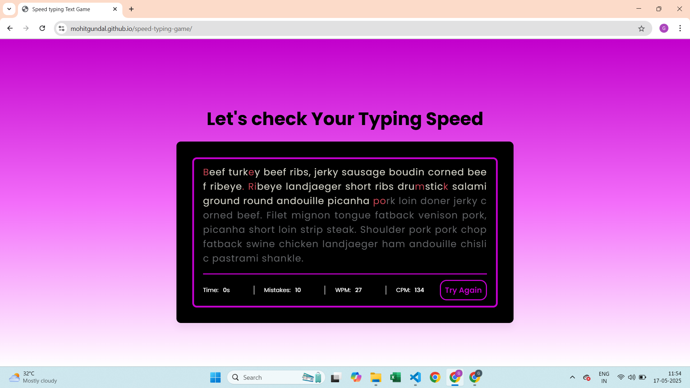
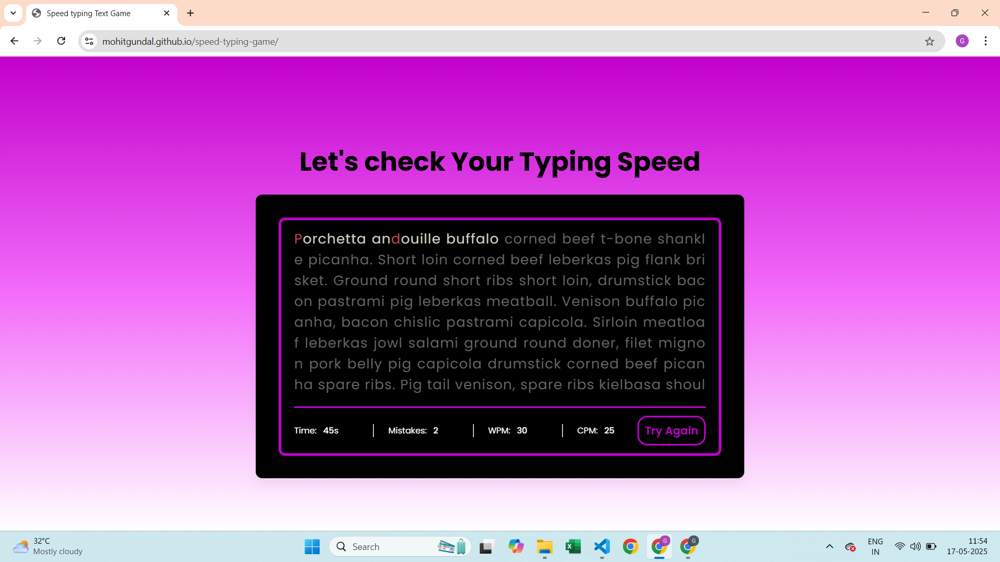

# speed-typing-game
A fun and interactive speed typing game built with HTML, CSS, and JavaScript. Test your typing speed and accuracy against the clock!

## Features

- Random word generation
- Countdown timer
- Live score tracking
- Game over and restart functionality
- Clean and responsive user interface

## Demo
https://mohitgundal.github.io/speed-typing-game/

## Screenshots
## Home Screen

## During typing

## Results


## Tech Stack

- HTML
- CSS
- JavaScript

## How to Run Locally

1. Clone this repository:
   ```bash
   git clone https://github.com/mohitgundal/speed-typing-game.git
